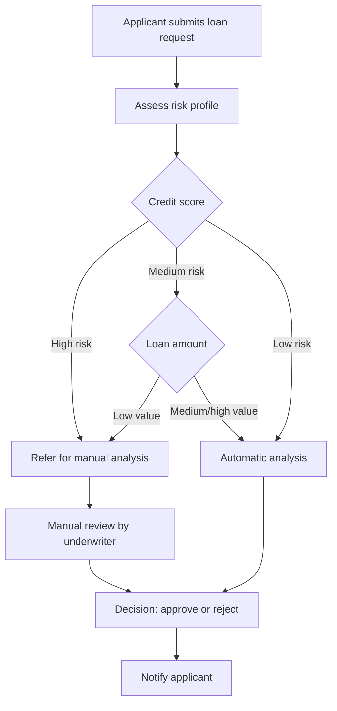

# Architecture & Domain-Driven Design

## Domain-Driven Design (DDD)

This project follows a layered DDD structure:
- **api**: HTTP boundary (controllers, DTOs, mappers)
- **app**: application services (use cases, orchestrating domain logic)
- **domain**: entities, value objects, repository interfaces, domain exceptions
- **infra**: persistence and security implementations, adapters for external tech (OAuth2/Okta integration)

The goal is clarity of boundaries, testability, and technology-agnostic domain logic.

## Strategic Vision

This loan application system is designed to handle the complete loan lifecycle with clear domain boundaries and business rules. The system will evolve to support multiple bounded contexts:

### Core Bounded Contexts
- **Authentication & Authorization**: Fully delegated to Okta via OAuth2. This backend does not manage or store user identities or authentication data locally (except, optionally, keeping basic user profile info from Okta claims).
- **Loan Context**: Loan applications, risk assessment, and approval workflows
- **Payment Context**: Loan disbursement, repayment tracking, and payment processing
- **Notification Context**: Communication with applicants and stakeholders

### Loan Decision Process

The loan approval workflow follows a risk-based decision tree:


### Domain Events
The system will implement domain events to maintain loose coupling between contexts:
- `UserRegistered` - Published when a new user is registered via Okta and (optionally) tracked locally
- `LoanApplicationSubmitted` - Loan context publishes when application is created
- `RiskAssessmentCompleted` - Risk analysis results available
- `LoanApproved/Rejected` - Final decision communicated
- `PaymentScheduled` - Payment context handles repayment setup

## Project Structure

```
src/
  main/
    kotlin/com/loanapp/
      Application.kt
      customer/             # Domain and business logic for customer data
      shared/               # Cross-cutting concerns (e.g., exception handler)
      infra/
        persistencie/       # Persistence implementation
        security/           # Security and OAuth2/Okta integration
    resources/
      application.yml       # Runtime configuration
  test/
    kotlin/com/loanapp/    # Integration and unit tests
    resources/             # Test configuration
```

## Code Style & Conventions
- Kotlin with Spring idioms
- Domain-driven layering: `api` → `app` → `domain` → `infra`
- Value objects for `Email`, `UserId` (no Password handling as auth is external)
- Centralized error handling in `shared/api/GlobalExceptionHandler.kt`
